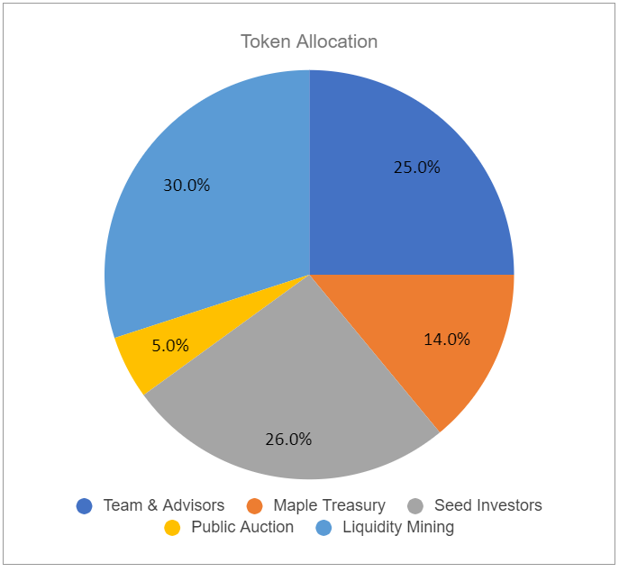
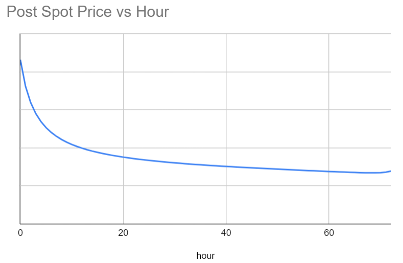
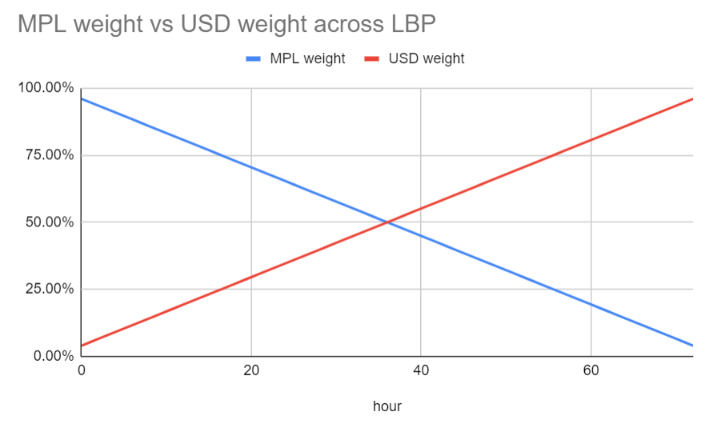

# Frequently Asked Questions

## How to participate in the Maple LBP?

#### Start by reading the [Guide to the Maple LBP.](https://maplefinance.ghost.io/guide-to-the-maple-lbp/)

The Maple LBP Guide covers:  
1\) How LBP price discovery works  
2\) How to participate in the Maple LBP  
3\) Model LBP Scenarios

## What is the purpose of token distribution?

The LBP event is used to distribute the Maple governance token to the broader Maple community to decentralize decision-making power. It also fosters initial price discovery for the MPL token.

## What is a Liquidity Bootstrapping Pool?

Balancer Liquidity Bootstrapping Pools are a special type of liquidity pool that adjusts pool weights over time. Unlike Uniswap AMM liquidity pools which are fixed at 50:50, the flexible weights in the Balancer pool can support an unbalanced ratio of tokens.

## Why was an LBP selected?

* **Capital Efficiency**: Only a small portion of the priced asset is required to initiate a pool and optimize the distribution
* **Fairness**: The linear step-down creates constant downward pressure on the price balancing upward buy pressure, ideally keeping the price oscillating around market value
  * Discourages arbitrage bot manipulation as they can't count on the price going up steadily
  * Large buyers are incentivized to split their trades into a series of smaller tranches over a longer period of time

This results in a better funded project with a wider distribution of tokens within its community.

## Where do proceeds go?

After the LBP concludes, the proceeds will be transferred to the Maple DAO Treasury.

## What are the LBP parameters?

* Pool tokens: MPL and USDC
* MPL start balance: 500K
* USDC start balance: 850K
* MPL start weight: 96
* MPL end weight: 4
* USDC start weight: 4
* USDC end weight: 96
* Swap fee: for first few minutes 10%, reduces to 0.3% after
* Duration: 72 hours

## What is the last fully diluted valuation valuation?

The last Maple private raise was completed in March 2021 with a fully diluted valuation of $50M or $5 per Maple token.

## What is the token allocation?

There is a fixed supply of 10,000,000 MPL tokens.

## What is the vesting schedule for team and investors?

Team has a 2 year vesting schedule and seed investors have a 1.5 year vesting schedule.

## What tokens do I need to participate?

The Maple LBP will be comprised of two assets: MPL and USDC. While other tokens will be accepted for the swap, we recommend preparing USDC to exchange for MPL. If you swap using other tokens, you may face a higher price as Balancer's "multihop" across pools will incur transaction costs while converting your token to USDC.

You will also need ETH for gas costs.

## What is the intial price?

The starting price of the Maple LBP will be **$40.80**. Speaking generally, the commonly advised setup of a Balancer LBP is starting price 4x the end price based on the final weightings, in this case the weightings suggest an end price of ~$10.

The participants themselves will determine where the price settles, if there's no demand the final price can drop below $10.

## Why is the transaction cost 10% in the first minutes?

For the first few minutes, the transaction costs will start at 10% then fall to 0.3% where they will remain for the rest of the LBP. The goal here is to deter bot involvement at the early state of the pool, in the best interest of our community members. It is during these early stages of the pool that the price will be dropping the fastest. By participating early in the LBP, you may pay a premium on the MPL token. The ideal scenario would look like something pictured below, where price declines at the beginning, and then remains stable throughout, resulting in a fair distribution of tokens at similar price for all participants.

## How are the price weights expected to change over time?

There will be a linear step-down, from the starting weight of MPL:USDC = 96:4 to MPL:USDC = 4:96 at the end of the pool.

## **What is the public MPL token address?**

**Token Contract Address:** 0x33349B282065b0284d756F0577FB39c158F935e6

**Token Symbol:** MPL

## **What were the past fundraising rounds?**

**Oct 2020**: Seed, $1.3M total, for ~2.6M MPL, price $0.5 per MPL, 5% unlock at Token Genesis Event \(TGE\) and 18 month linear vest

**Jan 2021**: Strategic OTC from Treasury, $1.4M total at $3 per MPL, 12 month linear vest starting from TGE

**Mar 2021**: Strategic OTC from Treasury, $0.5M total at $5 per MPL, 12 month linear vest starting from TGE

Information on initial investors available here:

[https://www.coindesk.com/maple-finance-corporate-lending-defi](https://www.coindesk.com/maple-finance-corporate-lending-defi)

[https://www.coindesk.com/maple-finance-raises-1-4m-for-its-reputation-based-defi-lending-platform](https://www.coindesk.com/maple-finance-raises-1-4m-for-its-reputation-based-defi-lending-platform)

## **How many tokens will be in circulation after the LBP's completion?**

500,000 MPL from the LBP will be available straight away as well as an additional 130,000 MPL which is a 5% unlock from the seed

Some of the 30% allocated to liquidity mining will be released over first 6 months.

## **Who are the team members?**

Sid Powell and Joe Flanagan are co-founders of Maple Finance. They’ve both worked in traditional finance where they participated in $3b+ of corporate bond issuance, established and ran a $200m+ bond funding program, and managed finances at a commercial lending FinTech company.

The rest of the team is available here:



## What's the plan for secondary liquidity?

We'll be setting up a 50:50 MPL:USDC Balancer pool 1-2 days after the LBP closes. This is the pool that will be used for Staking the Launch Pool when the protocol hits mainnet.

The initial MPL:USDC in the Balancer pool used for Staking will be provided by the investors from the January round, which was for the purpose of Staking.

Other holders of MPL will be able to provide liquidity to this pool.

##  **What's the plan with decentralization and governance?**

Currently the Maple DAO has a \(4\) of \(6\) multisig comprising core team \(minority\) and early investors. We would like to progressively decentralize by including community members and MPL holders in governance processes.

## **When will there be a live product?**

We launched the token now because it's required for staking the Launch Pool. We will be deploying the Maple protocol to mainnet 1-2 weeks after the LBP closes \(1 May\).

The rollout will look like this:

T = 0: Deployment to Mainnet

T + 3 days: First Lending Pool opened to general DeFi for Liquidity Mining \(deposit USDC on 6 month lock\). The USDC funds loans to the first borrowers. MPL rewards available

T + 5 days: First cohort of loans funded

T + 4-6 weeks: Second cohort of loans funded and Second Lending Pool opened

T + 4-8 weeks: Staking opens to general DeFi. Staking involves putting USDC:MPL into Balancer Pool and staking the BPTs to the First or Second Lending Pool.

